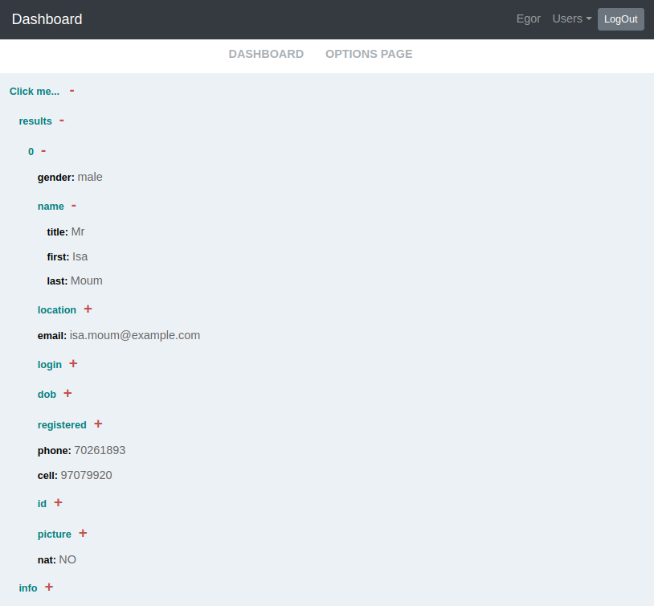

# API dashboard

A simple full-stack application that allows users to request data
from multiple external APIs and display the results in the form of
a table or a collapsible JSON structure depending on the response data structure.

Used APIs:

- [Breaking Bad Quotes API](https://breakingbadquotes.xyz/) (CORS)
- [Random User Generator](https://randomuser.me/)
- [Neger.Date](https://date.nager.at/) (CORS)
- [Trivia DB](https://opentdb.com/) (CORS)
- [ReqRes](https://reqres.in/)
- [Public APIs](https://api.publicapis.org/) (CORS)
- [Joke API](https://v2.jokeapi.dev)
- [Jikan API](https://jikan.moe)

Some of them use CORS policy so I've implemented the express server to bypass it. You can find it in /dashboard-server folder
## Requirements

- Docker
- Network accessible web server hosting the docker binary.
- For Linux: docker-compose should be installed.

## Run development environment:

To get start just run this command from project folder:

```
(proj)$ docker compose up

```

and get acces to the app on http://localhost:3050/

# Features

### Welcome Page
Here you can Singnin/Signup


### Main Page
Here you can see four randomly selected APIs to work with. The API list is changing everytime you change the current user or refresh the page.


When you click on one of the cards the request is fired and you get back a result in form of Table or Foldable JSON structure (depends on which data structure you got back from the api)

Table                      |  JSON
:-------------------------:|:-------------------------:
  |  

### Options Page
On this page you can create new users or edit existing ones.


All created users are listed in the dropdown menu at the header:


## Tech Stack & Technologies
* React
* Redux
* JWT
* Node.js
* Express
* MongoDB
* Docker
* Nginx
